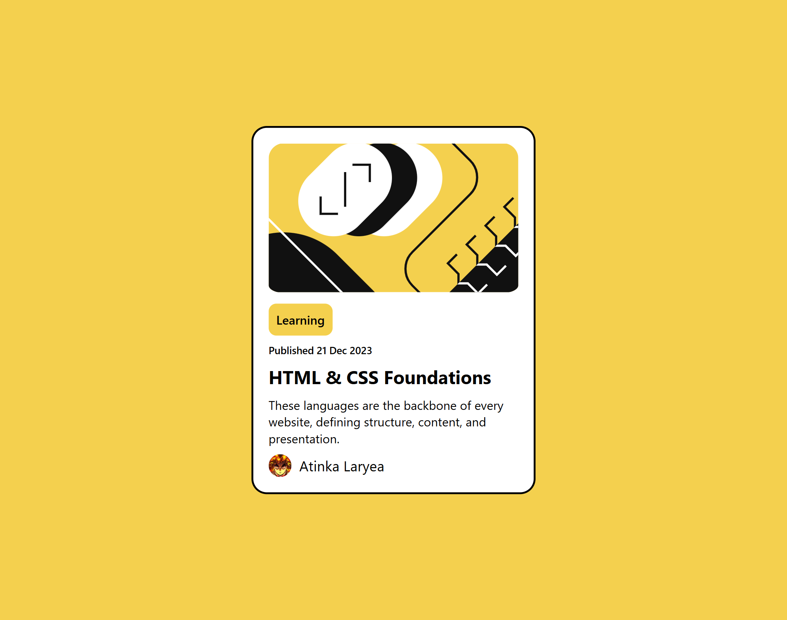

# Blog Card - FrontendMentor Challenge

## Overview
This is a beginner level project form [FrontendMentor](https://www.frontendmentor.io/). It was very simple and easy to complete. I even went on to add a few touches to it.

## Built With
* HTML - For Structure
* CSS - For Styling

## Live Link
https://atkthedeveloper.github.io/blog-card-FrontendMentor/

## Challenge Link
https://www.frontendmentor.io/challenges/blog-preview-card-ckPaj01IcS
